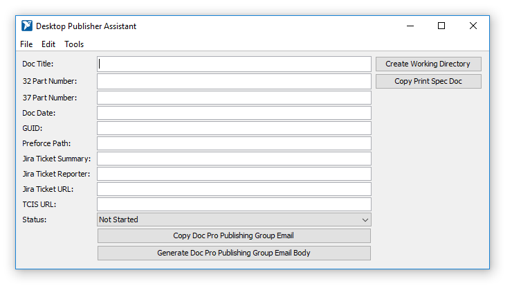

# Desktop Publisher Assistant

Desktop Publisher Assistant is a powerful organization tool for Desktop Publishers at National Instruments. This tol has been created to minimize mistakes, and because all of the information is stored locally on each user's machine, there is no security risk to National Instruments.

## Running Desktop Publisher Assistant

Since the program is an executable .jar, the software does not require installation. In order to run the .jar, however, the Java Runtime Environment (JRE) must be installed on your system. In-depth instructions for installing the latest JRE can be found [here](https://www.ntu.edu.sg/home/ehchua/programming/howto/JDK_HowTo.html#jdk-install).

Once you have installed the JRE:

1. Visit the [Desktop Publisher Assistant release page on GitHub](https://github.com/alexporrello/DesktopPublisherAssistant/releases).
2. Download the latest release, found at the top of the page. (If you have trouble finding it, search the page for "Desktop.Publisher.Assistant.jar.")
3. Once the file has downloaded, move it out of your downloads folder to a convenient location on your computer.
4. Assuming you installed the JRE correctly, double-clicking the .jar file should open the application. If you would like to create a desktop shortcut, right-click on the .jar file and select *Send To* >> *Desktop (Create Shortcut)*.
5. If you have any problems running the application, don't hesistate to create an issue on the [Desktop Publisher Assistant's issue page on Github](https://github.com/alexporrello/DesktopPublisherAssistant/issues).

## Program Overview

Desktop Publisher Assistant is a simple enough application, but many features have been included to speed up the PPM process. To use this program to the fullest, it is recommended that you read through the whole (short) guide.

### Logging

Desktop Publisher Assistant's logging functionality is simple and user-friendly.

#### Ticket Files

A ticket file is essentially a project file. A ticket file contains the following information: the project's _Doc Title_, _32_ and _37 Part Numbers_, _Doc Date_, _GUID_, _Perforce Path_, _Jira Ticket Summary_, _Jira Ticket Reporter_, _Jira Ticket URL_, _TCIS URL_, and the _Status_ (whether it is _Not Started_, _In Progress_, _Sent for Approval_, or _Done_).

When a user opens Desktop Publisher Assistant for the first time, it creates a folder in %APPDATA% called _Desktop Publisher Assistant_, to which all tickets are automatically saved. 

Ticket files are named automatically from the program's _Jira Ticket Summary_ text field. If a user attempts to save the ticket file but information has not yet been entered in the _Jira Ticket Summary_ text field, a dialog will prompt the user to fill out the _Jira Ticket Summary_ text field.

#### Log Dialog

Navigating to _File_ >> _View Log_ (or using the keyboard shortcut ctrl+l) will open the Log Dialog.

The Log Dialog is a list of the ticket files saved to the default folder in %APPDATA%. To the left of the window is the _Jira Ticket Summary_, and to the right are each ticket's _Status_. Clicking on a ticket will open it in a new window.

**TIP:** If the status of a ticket changes and you would like to update the ticket file, open the Log Dialog and click on the ticket's status. This action will cycle through the four options (_Not Started_, _In Progress_, _Sent for Approval_, and _Done_). Each click will automatically update the correct ticket file.

### Menu

#### File Menu

* **View Log**: Displays the log dialog
* **Open Ticket**: Opens a file explorer so the user can open a ticket
* **Save Ticket**: Saves the current ticket to default %APPDATA% location

#### Edit Menu

* **Clear All**: Sets everything back to its default state

#### Tools Menu

* **Copy Doc Pro Publishing Group Email**: Copies the Doc Pro Publishing Group email to your clipboard.
* **Generate Doc Pro Publishing Group Email Body**: Generates the body of the publishing email to be sent to the Doc Pro Publishing Group.
* **Copy Print Template Perforce Path**: Copies the path to the print templates in Perforce.

### Keyboard Shortcuts

* **ctrl+l**: displays the log dialog
* **ctrl+o**: opens a ticket file in the current window.
* **ctrl+s**: saves the current ticket file to default location (%APPDATA%/Desktop Publisher Assistant)
* **ctrl+shift+x**: clears all of the text fields
* **ctrl+e**: copies the Doc Pro Publishing group's email to your clipboard
* **ctrl+shift+e**: generates the body of the email to be sent to Doc Pro Publishing Group

### Text Fields

1. **Auto-select-all:** Whenever a user selects a text area, the entire text area's contents is highlighted.
2. **Auto-paste:** Any recognizeable item that has been copied to the desktop publisher's clipboard (for example, part numbers or GUIDs) will be auto-pasted into the correct text area.