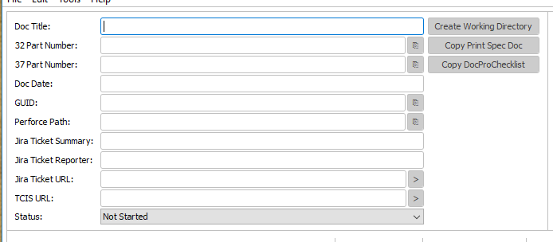
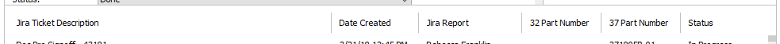
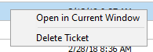

# Desktop Publisher Assistant

Desktop Publisher Assistant is a powerful organization tool created for Desktop Publishers at National Instruments. It was created to automate many desktop publishing procedures and to minimize mistakes.

## Running Desktop Publisher Assistant

The program is an executable .jar, so the software does not require installation. To run the .jar, however, the Java Runtime Environment (JRE) must be installed on your system. In-depth instructions for installing the latest JRE can be found [here](https://docs.oracle.com/goldengate/1212/gg-winux/GDRAD/java.htm#BGBFJHAB).

Once you have installed the JRE...

1. Visit the [Desktop Publisher Assistant release page on GitHub](https://github.com/alexporrello/DesktopPublisherAssistant/releases).
2. Download the latest release, found at the top of the page. (If you have trouble finding it, search the page for "Desktop.Publisher.Assistant.jar.")
3. Once the file has downloaded, you can move it out of your download folder to a convenient location on your computer.
4. Assuming you installed the JRE correctly, double-click the .jar to launch application 
5. If you have any problems running the application, please create an issue on the [Desktop Publisher Assistant's issue page on Github](https://github.com/alexporrello/DesktopPublisherAssistant/issues).

**TIP:** If you would like to create a desktop shortcut, right-click on the .jar file and select *Send To* >> *Desktop (Create Shortcut)*.

## Using the Software

While Desktop Publisher Assistant appears to be a simple application, many features have been implemented to automate Desktop Publishing procedures. To use this program to its fullest, you should read through this guide. Doing so will take about ten minutes.

### 1. Populate the Program's Main Body

The program's main body is a collection of labeled text areas designed to organize information during a PPM. You will be able to populate all of the fields with information gathered from the Jira ticket page except _Doc Date_. You will find the document date in TCIS.

### 2. Create Working Directory and Copy Necessary PPM Templates

As part of the PPM process, a desktop publisher will often be working with four files:

1. The 32 file
2. The print specification document
3. The 37 document
4. The doc pro checklist document

There are three buttons at the top right of the application's main window that are designed to simplify the process of managing these files: _Create Working Directory_, _Copy Print Spec Doc_, and _Copy DocProChecklist.pdf_. When the application is first loaded, they are all disabled. The following describes how to enable the buttons and what their functions are.

#### 2.1. _Create Working Directory_

* **To enable the button**, fill out the ticket's _Doc Title_.
* **Click the button** to create a folder on your _Desktop_ that mimics the folder structure in Perforce. It contains two folders:
    * _Checklists_: created to contain DocProChecklist.pdf
    * _PDFs_: created to contain the 32 and/or 37 document(s)

#### 2.2. _Copy Print Spec Doc_ (Optional)

Many writers submit PPMs for 37-type docs only. You only need to worry about the _Copy Print Spec Doc_ button if a writer submits a PPM for a 32-type document.

* **To enable the button**, enter the ticket's _Doc Title_ and its _32 Part Number_.
* **Click the button** to copy a blank print spec document into the working directory (_Desktop_ >> _DOC-TITLE_ >> _PDFs_). The print spec document will automatically get its name from the information entered in the _32 Part Number_ text field.

#### 2.3. _Copy DocProChecklist.pdf_

* **To enable the button**, enter the _Document Title_, the _Doc Date_, and one or both of the following: the _32 Part Number_ and/or the _37 Part Number_.
* **Clicking the button** will copy the DocProChecklist.pdf into the working directory (_Desktop_ >> _DOC-TITLE_ >> _Checklists_). The editable fields in the DocProChecklist.pdf will be auto-populated from info entered by the user.

### 3. PDF XMP Updater Window

The PDF XMP Updater window (displayed in the right side of the application) is a convenient way to update a 37-type document's XMP.

To update a 37-type doc's XMP, drag and drop the 37 PDF and the new XMP into the window one a time or both at once. (Alternately, if you would rather navigate to the files with a file explorer, click on _Path to PDF..._ or _Path to XMP..._.) When you have attached both documents, click the _Update_ button to update the PDF's metadata.

If you leave the _Update PDF Initial View Properties_ radio button selected, the output PDF's initial view will conform to NI Desktop Publishing standards. If you deselect the radio button, the PDF's initial view properties remain unmodified.

### 4. Logging

Desktop Publisher Assistant's logging functionality is simple and user-friendly. 

#### 4.1. Ticket Files

A ticket file is essentially a project file. A ticket file contains the following information: the project's _Doc Title_, _32_ and _37 Part Numbers_, _Doc Date_, _GUID_, _Perforce Path_, _Jira Ticket Summary_, _Jira Ticket Reporter_, _Jira Ticket URL_, _TCIS URL_, and the _Status_ (which could be _Not Started_, _In Progress_, _Sent for Approval_, or _Done_).

When a user opens Desktop Publisher Assistant for the first time, it creates a folder in %APPDATA% called _Desktop Publisher Assistant_, to which all tickets are automatically saved. 

Ticket files are named automatically from the program's _Jira Ticket Summary_ text field. If you try to save the ticket file but have not yet entered information in the _Jira Ticket Summary_ text field, a dialog will prompt you to fill out the _Jira Ticket Summary_ text field.

#### 4.2. Log Window

The log window is displayed at the bottom of the application. Log entries are loaded from the %APPDATA% folder where ticket files are automatically saved. The log window displays the following information about tickets:

1. **Jira Ticket Description:** (necessary to save the file)
2. **Jira Report:** The name of the writer/translator who created the ticket
3. **32 Part Number**
4. **37 Part Number**
5. **Status:** The ticket's status can be _Not Started_, _Started_, _Sent for Approval_, or _Done_

**TIP:** Click the labels above the list of logs if you want to change how they are sorted.

**TIP:** If the status of a ticket changes and you would like to update the ticket file, click the ticket's status in the log window. This action will cycle through the four options (_Not Started_, _In Progress_, _Sent for Approval_, and _Done_). Each click will automatically update the correct ticket file.

To display your options, right-click a Log entry:

* **Open in Current Window**: Resets the current main window and populates it with the selected ticket file's information.
* **Open in New Window**: Opens the ticket file in a new window and leaves the current window untouched.
* **Delete Ticket**: Deletes the ticket file from _%APPDATA%/Desktop Publisher Assistant_. Use with caution, as deleted files cannot be recovered.

### 5. Menu

#### 5.1. File Menu

* **Open Ticket**: opens a file explorer so the user can open a ticket
* **Save Ticket**: saves the current ticket to default %APPDATA% location

#### 5.2. Edit Menu

* **Clear All**: sets everything back to its default state

#### 5.3. Tools Menu

* **Email Doc Pro Publishing Group**: sends the boilerplate email needed to publish PPMs
* **Copy Print Template Perforce Path**: copies the path to the print templates in Perforce

#### 5.4. Help

* **Check for Updates**: checks GitHub to see if there are any new app releases

### 6. Keyboard Shortcuts

* **ctrl+o**: opens a ticket file in the current window
* **ctrl+s**: saves the current ticket file to default location (%APPDATA%/Desktop Publisher Assistant)
* **ctrl+shift+x**: clears all of the text fields
* **ctrl+e**: generates the boilerplate publishing email and opens it in your default email client

### 7. Text Fields

* **Auto-select-all:** When you click into a text area, its contents are highlighted.
* **Auto-paste:** Any recognizable item that you have copied to the system's clipboard (for example, part numbers or GUIDs) will be auto-pasted into the correct text area.
* **Triple-click:** If you triple click on a text field that has a URL, the page will open in your default web browser.