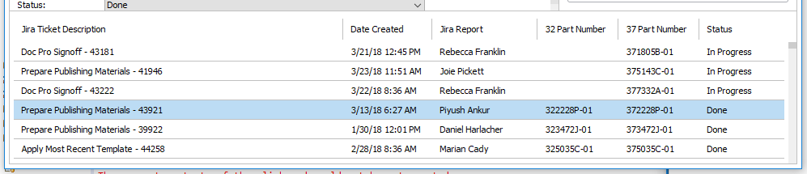

# Desktop Publisher Assistant

Desktop Publisher Assistant is a powerful organization tool created for Desktop Publishers at National Instruments. It was created not only to automate many desktop publishing procedures, but also to minimize mistakes.

## Running Desktop Publisher Assistant

The program is an executable .jar, so the software does not require installation. To run the .jar, however, the Java Runtime Environment (JRE) must be installed on your system. In-depth instructions for installing the latest JRE can be found [here](https://docs.oracle.com/goldengate/1212/gg-winux/GDRAD/java.htm#BGBFJHAB).

Once you have installed the JRE:

1. Visit the [Desktop Publisher Assistant release page on GitHub](https://github.com/alexporrello/DesktopPublisherAssistant/releases).
2. Download the latest release, found at the top of the page. (If you have trouble finding it, search the page for "Desktop.Publisher.Assistant.jar.")
3. Once the file has downloaded, move it out of your downloads folder to a convenient location on your computer.
4. Assuming you installed the JRE correctly, double-clicking the .jar file should open the application 
5. If you have any problems running the application, create an issue on the [Desktop Publisher Assistant's issue page on Github](https://github.com/alexporrello/DesktopPublisherAssistant/issues).

**TIP:** (If you would like to create a desktop shortcut, right-click on the .jar file and select *Send To* >> *Desktop (Create Shortcut)*.)

## Program Overview

While Desktop Publisher Assistant appears to be a simple application, many features have been implemented to automate Desktop Publishing procedures. To use this program to its fullest, it is recommended that you read through the entirety of this short guide.

### Button Functions

There are three buttons in the top right of the application's main window: _Create Working Directory_, _Copy Print Spec Doc_, and _Copy DocProChecklist.pdf_. When the application is first loaded, they are all disabled. The following describes (1) how to enable the buttons and (2) their functions.

#### _Create Working Directory_

As part of the PPM process, a desktop publisher will often be working with four files: (1) the 32 file, (2) the print specification document, (3) the 37 document, and (4) a doc pro checklist document. The _Create Working Directory_ button greatly simplifies the process of managing these files.

* **To enable the button**, fill out the ticket's _Doc Title_.
* **Clicking the button** creates a folder on your _Desktop_ that mimics the Perforce folder structure. It contains two folders: (1) _Checklists_, created to contain DocProChecklist.pdf, and (2) _PDFs_, created to contain the 32 and/or 37 document(s).

#### _Copy Print Spec Doc_

* **To enable the button**, enter the ticket's _Doc Title_ and its _32 Part Number_.
* **Clicking the button** copies a blank print spec document into the working directory (_Desktop_ >> _DOC-TITLE_ >> _PDFs_). The print spec document will automatically get its name from the information entered in the _32 part number_ text field.

#### _Copy DocProChecklist.pdf_

* **To enable the button**, enter the _Document Title_, the _Doc Date_, and one or both of the following: the _32 Part Number_ and/or the _37 Part Number_.
* **Clicking the button** will copy the DocProChecklist.pdf into the working directory (_Desktop_ >> _DOC-TITLE_ >> _Checklists_). The editable fields in the DocProChecklist.pdf will be auto-populated from info entered by the user.

### Logging

Desktop Publisher Assistant's logging functionality is simple and user-friendly.

#### Ticket Files

A ticket file is essentially a project file. A ticket file contains the following information: the project's _Doc Title_, _32_ and _37 Part Numbers_, _Doc Date_, _GUID_, _Perforce Path_, _Jira Ticket Summary_, _Jira Ticket Reporter_, _Jira Ticket URL_, _TCIS URL_, and the _Status_ (which could be _Not Started_, _In Progress_, _Sent for Approval_, or _Done_).

When a user opens Desktop Publisher Assistant for the first time, it creates a folder in %APPDATA% called _Desktop Publisher Assistant_, to which all tickets are automatically saved. 

Ticket files are named automatically from the program's _Jira Ticket Summary_ text field. If a user attempts to save the ticket file but information has not yet been entered in the _Jira Ticket Summary_ text field, a dialog will prompt the user to fill out the _Jira Ticket Summary_ text field.

#### Log Window

The log window is displayed at the bottom of the application. Log entries are loaded from the %APPDATA% folder where ticket files are automatically saved. The log window displays the following information about tickets:

1. **Jira Ticket Description:** (necessary to save the file)
2. **Jira Report:** The name of the writer/translator who created the ticket
3. **32 Part Number**
4. **37 Part Number**
5. **Status:** The ticket's status can be one of four: _Not Started_, _Started_, _Sent for Approval_, and _Done_

**TIP:** Clicking on the labels above the list of logs will change how they are sorted. (For example, clicking on _Jira Report_ will sort the log entries alphabetically by the name of the writer/translator who created the ticket.)

**TIP:** If the status of a ticket changes and you would like to update the ticket file, click on the ticket's status in the log window. This action will cycle through the four options (_Not Started_, _In Progress_, _Sent for Approval_, and _Done_). Each click will automatically update the correct ticket file.

Right-clicking on a Log entry will display a context menu with three options:

1. **Open in Current Window**: Resets the current main window and populates it with the selected ticket file's information.
2. **Open in New Window**: Opens the ticket file in a new window and leaves the current window untouched.
3. **Delete Ticket**: Deletes the ticket file from _%APPDATA%/Desktop Publisher Assistant_. Use with caution, as deleted files cannot be recovered.

### PDF XMP Updater Window

The PDF XMP Updater window (displayed in the right side of the application) is a convenient way to update a PDF's XMP. Drag and drop the PDF and the XMP into the window one a time or both at once. (Alternately, if you would rather navigate to the files with a file explorer, click on the empty text fields.) When you have attached both documents, click the "Update" button to update the PDF's metadata.

If you leave the "Update PDF Initial View Properties" radio button selected, the output PDF's initial view will conform to NI Desktop Publishing standards. Deselecting the radio button will leave the PDF's initial view properties untouched.

### Menu

#### File Menu

* **Open Ticket**: Opens a file explorer so the user can open a ticket
* **Save Ticket**: Saves the current ticket to default %APPDATA% location

#### Edit Menu

* **Clear All**: Sets everything back to its default state

#### Tools Menu

* **Email Doc Pro Publishing Group**: Sends the boilerplate email needed to publish PPMs.
* **Copy Print Template Perforce Path**: Copies the path to the print templates in Perforce.

#### Help

* **Check for Updates**: Checks GitHub to see if there are any new app releases.

### Keyboard Shortcuts

* **ctrl+o**: opens a ticket file in the current window.
* **ctrl+s**: saves the current ticket file to default location (%APPDATA%/Desktop Publisher Assistant)
* **ctrl+shift+x**: clears all of the text fields
* **ctrl+e**: generates the boilerplate publishing email and opens it in your default email client.

### Text Fields

* **Auto-select-all:** When a user clicks into a text area, its contents are highlighted.
* **Auto-paste:** Any recognizable item that has been copied to the system's clipboard (for example, part numbers or GUIDs) will be auto-pasted into the correct text area.
* **Triple-click:** If you triple click on a text field that has a URL, the page will open in your default web browser.