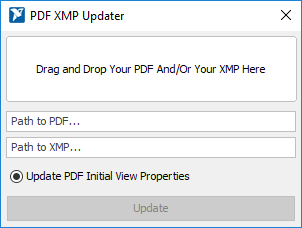

# Desktop Publisher Assistant

Desktop Publisher Assistant is a powerful organization tool for Desktop Publishers at National Instruments. It was created to minimize mistakes during PPMs and other desktop publishing procedures.

## Running Desktop Publisher Assistant

Since the program is an executable .jar, the software does not require installation. To run the .jar, however, the Java Runtime Environment (JRE) must be installed on your system. In-depth instructions for installing the latest JRE can be found [here](https://docs.oracle.com/goldengate/1212/gg-winux/GDRAD/java.htm#BGBFJHAB).

Once you have installed the JRE:

1. Visit the [Desktop Publisher Assistant release page on GitHub](https://github.com/alexporrello/DesktopPublisherAssistant/releases).
2. Download the latest release, found at the top of the page. (If you have trouble finding it, search the page for "Desktop.Publisher.Assistant.jar.")
3. Once the file has downloaded, move it out of your downloads folder to a convenient location on your computer.
4. Assuming you installed the JRE correctly, double-clicking the .jar file should open the application. (If you would like to create a desktop shortcut, right-click on the .jar file and select *Send To* >> *Desktop (Create Shortcut)*.)
5. If you have any problems running the application, create an issue on the [Desktop Publisher Assistant's issue page on Github](https://github.com/alexporrello/DesktopPublisherAssistant/issues).

## Program Overview

While desktop publisher appears to be a simple application, many features have been implemented to speed up Desktop Publishing procedures. To use this program to its fullest, it is recommended that you read through the entirety of this short guide.

### Button Functions

There are two buttons in the top right of the application's main window: _Create Working Directory_ and _Copy Print Spec Doc_. The following describes their functions.

#### _Create Working Directory_

As part of the PPM process, a desktop publisher will often be working with four files: (1) the print (32) file, (2) the print specification document, (3) the online (37) file, and (4) a doc pro checklist document. The _Create Working Directory_ button greatly simplifies the process of managing these files.

If the desktop publisher has entered the ticket's _Doc Title_, pressing the _Create Working Directory_ button will duplicate Perforce's file structure on the user's desktop. It creates a folder (which gets its name from the _Doc Title_ text area) that contains two folders: _Checklists_ and _PDFs_.

The PDFs folder has is created to contain the online document, the print document, and the print specification document. A blank doc pro checklist is automatically copied into the _Checklists_ folder.

#### _Copy Print Spec Doc_

This button goes hand-in-hand with the _Create Working Directory_ button.

To copy a blank print specification document into _Desktop_ >> _DOC-TITLE_ >> _PDFs_, the user must enter the 32 part number and press the _Copy Print Spec Doc_ button. Not only will a blank print spec document be copied into the _PDFs_ folder, but it will automatically be named correctly (assuming that the 32 part number was entered correctly).

### Logging

Desktop Publisher Assistant's logging functionality is simple and user-friendly.

#### Ticket Files

A ticket file is essentially a project file. A ticket file contains the following information: the project's _Doc Title_, _32_ and _37 Part Numbers_, _Doc Date_, _GUID_, _Perforce Path_, _Jira Ticket Summary_, _Jira Ticket Reporter_, _Jira Ticket URL_, _TCIS URL_, and the _Status_ (which could be _Not Started_, _In Progress_, _Sent for Approval_, or _Done_).

When a user opens Desktop Publisher Assistant for the first time, it creates a folder in %APPDATA% called _Desktop Publisher Assistant_, to which all tickets are automatically saved. 

Ticket files are named automatically from the program's _Jira Ticket Summary_ text field. If a user attempts to save the ticket file but information has not yet been entered in the _Jira Ticket Summary_ text field, a dialog will prompt the user to fill out the _Jira Ticket Summary_ text field.

#### Log Dialog

Navigating to _File_ >> _View Log_ (or using the keyboard shortcut ctrl+l) will open the Log Dialog.

The Log Dialog is a list of the ticket files saved to the default folder in %APPDATA%. To the left of the window is the _Jira Ticket Summary_, and to the right are each ticket's _Status_. Clicking on a ticket will open it in a new window.

**TIP:** If the status of a ticket changes and you would like to update the ticket file, open the Log Dialog and click on the ticket's status. This action will cycle through the four options (_Not Started_, _In Progress_, _Sent for Approval_, and _Done_). Each click will automatically update the correct ticket file.

### PDF XMP Updater

The PDF XMP Updater dialog is a convenient way to update a PDF's XMP. To open the dialog, navigate to _Tools_ >> _Open XMP Updater Dialog_. Drag and drop the PDF and the XMP into the window one a time or both at once. (Alternately, if you would rather navigate to the files with a file explorer, click on the empty text fields.) When you have added both documents, click the "Update" button to update the PDF's metadata.

If you leave the "Update PDF Initial View Properties" radio button selected, the output PDF's initial view will conform to NI Desktop Publishing standards. Deselecting the radio button will leave the PDF's initial view properties untouched.

### Menu

#### File Menu

* **View Log**: Displays the log dialog
* **Open Ticket**: Opens a file explorer so the user can open a ticket
* **Save Ticket**: Saves the current ticket to default %APPDATA% location

#### Edit Menu

* **Clear All**: Sets everything back to its default state

#### Tools Menu

* **Email Doc Pro Publishing Group**: Sends the boilerplate email needed to publish PPMs.
* **Copy Print Template Perforce Path**: Copies the path to the print templates in Perforce.

### Keyboard Shortcuts

* **ctrl+l**: displays the log dialog
* **ctrl+o**: opens a ticket file in the current window.
* **ctrl+s**: saves the current ticket file to default location (%APPDATA%/Desktop Publisher Assistant)
* **ctrl+shift+x**: clears all of the text fields
* **ctrl+e**: copies the Doc Pro Publishing group's email to your clipboard
* **ctrl+shift+e**: generates the body of the email to be sent to Doc Pro Publishing Group

### Text Fields

1. **Auto-select-all:** Whenever a user selects a text area, the entire text area's contents is highlighted.
2. **Auto-paste:** Any recognizable item that has been copied to the desktop publisher's clipboard (for example, part numbers or GUIDs) will be auto-pasted into the correct text area.
